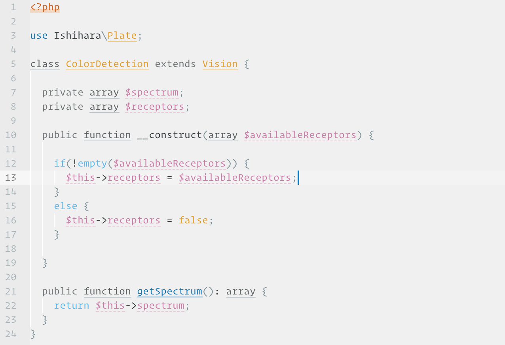

# Ishi Light
A light, muted/low-contrast Atom syntax theme for the colorblind. (I have Protanopia, would love feedback from other types of CVD.) Colors inspired by [Martin Krzywinski](http://mkweb.bcgsc.ca/colorblind/). The name is inspired by the [Ishihara test](https://en.wikipedia.org/wiki/Ishihara_color_test_plate).

<small style="color:gray">Font: Operator Mono Book</small>

## Change log
* **0.4.0** Improved contrast, supplemental bottom-border styling to help with color distinction.

## Work in Progress

| Status | Language | Progress |
| :----: | -------- | -------- |
| 🆗      | C          | 50% |
| ❓      | C#         | (not tested) |
| ❓      | C++         | (not tested) |
| ❓      | Clojure     | (not tested) |
| ❓      | CoffeeScript | (not tested) |
| ✅      | CSS        | 99%     |
| ✅      | Github Markdown         | 99% |
| 🆗      | Go         | 50% |
| ❓      | CoffeeScript | (not tested) |
| ✅      | HTML/XML       | 99%         |
| ❓      | Java | (not tested) |
| ✅      | JavaScript | 90% |
| ✅      | JSON | 99% |
| 🆗      | Less        | 90%     | 
| ❓      | Objective-C | (not tested) |
| ❓      | Perl | (not tested) |
| ✅      | PHP | 90% |
| ❓      | Python | (not tested) |
| ❓      | Ruby | (not tested) |
| 🆗      | Sass/SCSS | 90% |
| 🆗      | Shell Script | 90% |
| 🆗      | SQL | 90% |
| ❓      | TypeScript | (not tested) |
| ❓      | YAML | (not tested) |