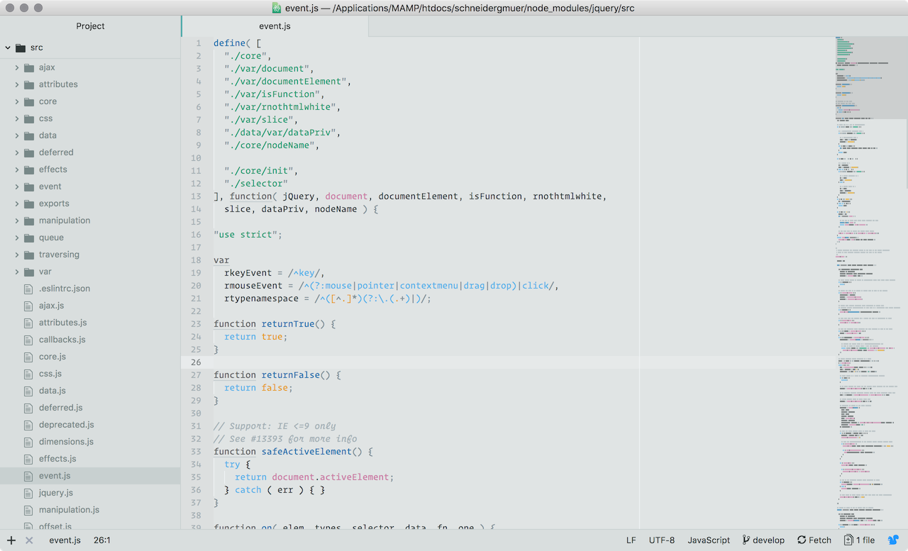

# Ishi Light
A light, muted/low-contrast Atom syntax theme for the color blind. Colors inspired by [Martin Krzywinski](http://mkweb.bcgsc.ca/colorblind/). The name is inspired by the [Ishihara test](https://en.wikipedia.org/wiki/Ishihara_color_test_plate).

Work in Progress!
